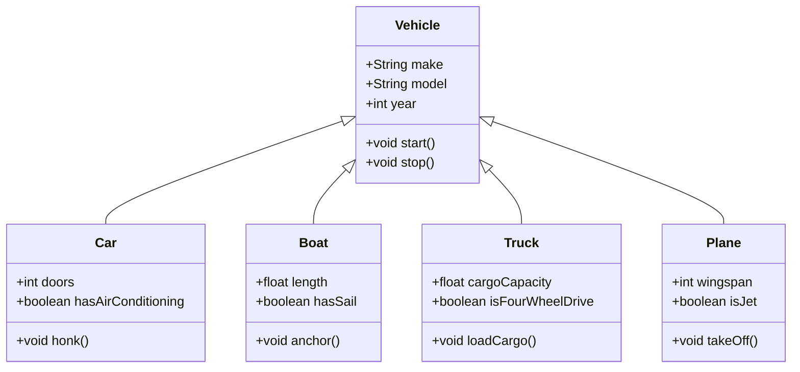

# Object Oriented Programming

<!--
- How far have you covered in object oriented programming?
-->

---
title: Goal
level: 2
transition: slide-up
---

### Our aim will be to implement the following class diagram.

